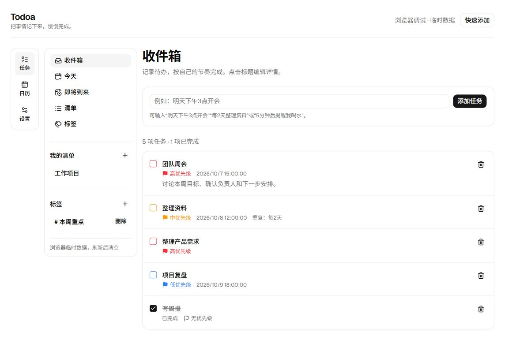
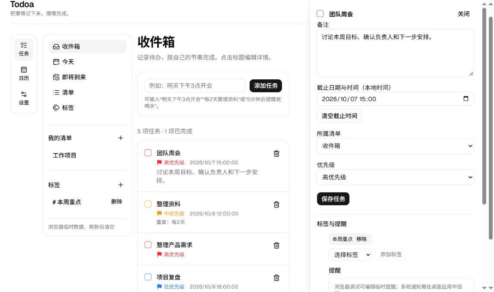
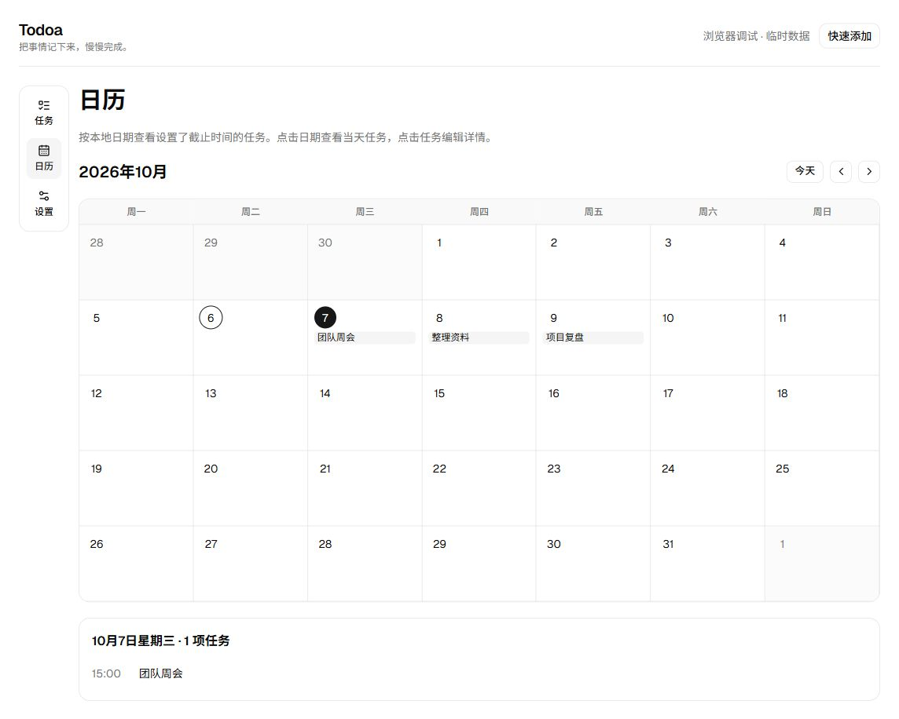

# Todoa

Todoa 是一款本地使用的 Windows 待办应用。任务、清单、标签和提醒保存在本机 SQLite 数据库中，无需账号或网络连接。

## 界面预览

以下截图来自浏览器调试页，使用临时示例数据拍摄；桌面版使用独立的持久化数据库。

### 收件箱与优先级



### 任务详情



### 日历



## 功能

- 在收件箱或清单中添加任务；可从自然语言输入中识别截止时间、重复规则和提醒时间。
- 编辑标题、纯文本备注、截止时间、所属清单和高／中／低／无四档优先级；在“已完成”查看完成任务，删除任务先移入回收站，可恢复或确认永久删除。
- 按收件箱、今天、即将到来、清单、标签和月历查看任务；点击日历中的任务打开右侧详情。
- 为任务分配标签和提醒；重复任务完成后生成下一次任务。
- 通过独立的快速添加窗口或 `Ctrl+Shift+Space` 全局快捷键记录任务；可从系统托盘找回窗口。
- 查看本地任务统计，在桌面版中备份与恢复数据库，并设置开机启动。

## 安装与数据

1. 在 [本地发布目录](releases/v1.0.1/) 获取 Windows x64 安装程序并运行。
2. 首次启动后，在收件箱输入任务；点击任务标题可编辑详情。
3. 在「设置 → 数据」中创建备份。备份文件**未加密**，请自行妥善保存。

桌面版的数据库位于 `%APPDATA%\com.todoa.desktop\todo.db`。浏览器调试页显示“浏览器调试 · 临时数据”，刷新后会清空，其内容不会进入桌面数据库。当前安装包未进行代码签名；Windows 10 x64 开发机上的构建、自动化测试及隔离身份原生界面检查已经完成。1.0.1 安装包的安装后操作、Windows 11 运行、安装版通知显示、真实登录自启及跨显示器 DPI 仍需目标环境验证。项目未提供自动更新服务。

## 开发与构建

需要 Node.js、pnpm、Rust x64 MSVC 工具链、Visual Studio C++ Build Tools、Windows SDK 和 WebView2 Runtime。依赖版本以仓库锁文件为准。

```powershell
pnpm install --frozen-lockfile
pnpm lint
pnpm test
pnpm build
cargo test --locked --manifest-path src-tauri/Cargo.toml --target x86_64-pc-windows-msvc
pnpm tauri dev --config src-tauri/tauri.dev.conf.json --target x86_64-pc-windows-msvc
```

生成 Windows x64 安装程序：

```powershell
pnpm tauri build --ci --bundles nsis --target x86_64-pc-windows-msvc
```

构建输出位于 `src-tauri/target/x86_64-pc-windows-msvc/release/bundle/nsis/`。开发版使用 `com.todoa.desktop.dev`，正式版使用 `com.todoa.desktop`，两者的数据目录隔离。直接运行 `pnpm dev` 可预览使用临时数据的浏览器界面，备份恢复和系统通知等原生能力需要在桌面版验证。

## 项目结构

- `src/domain/`：任务与日期规则。
- `src/data/`：浏览器临时存储、SQLite Repository 与数据库就绪检查。
- `src/features/`：任务、日历、清单、标签、提醒和设置界面。
- `src-tauri/`：Windows 窗口、托盘、快捷键、数据库迁移、提醒调度及安装包配置。
- `docs/PROJECT_STATE.md`：开发过程、验收证据和仍需验证的边界。

Todoa 1.0.1 是 Windows x64 发布版本；没有账号、云同步或协作功能。
